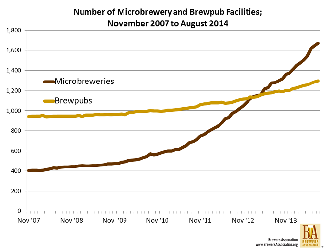
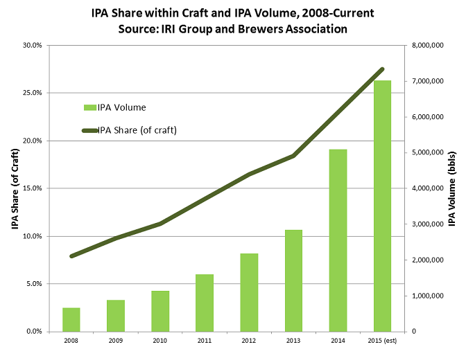
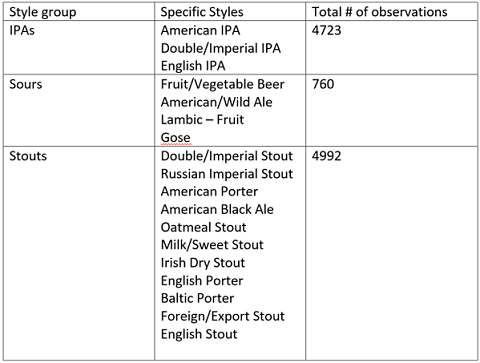
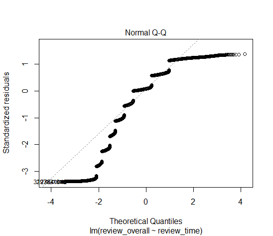
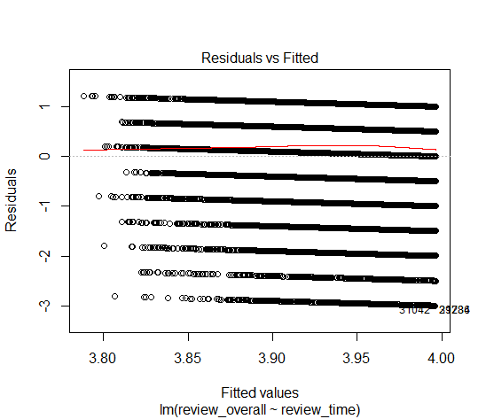

```{r setup, include=FALSE}
knitr::opts_chunk$set(echo = TRUE)
library(dplyr)
library(latexpdf)
library(stringr)
library(markdown)
beer_reviews <- read.csv("beer_reviews.csv")
unique_reviews <- distinct(beer_reviews, review_profilename, .keep_all = T)
attach(unique_reviews)
unique_reviews <- unique_reviews[order(review_time),]
unique_reviews <- subset(unique_reviews,  review_time > 1199145660, c(review_profilename, review_time, review_overall, beer_style))

ipas <- unique_reviews %>% filter(str_detect(beer_style, "IPA"))
sours <- unique_reviews %>% filter(str_detect(beer_style, "Sour|Gose|Wild|Fruit"))
stouts <- unique_reviews %>% filter(str_detect(beer_style, "Stout|Black|Porter"))

t_ipas <- t.test(ipas$review_overall[ipas$review_time>1293840060], ipas$review_overall[ipas$review_time<1293840060], mu=0, alternative = "greater", conf.level = 0.95)

t_sours <- t.test(sours$review_overall[sours$review_time>1293840060], sours$review_overall[sours$review_time<1293840060], mu=0, alternative = "greater", conf.level = 0.95)

t_stouts <- t.test(stouts$review_overall[stouts$review_time>1293840060], stouts$review_overall[stouts$review_time<1293840060], mu=0, alternative = "greater", conf.level = 0.95)
```

## Introduction
With \$26 billion in US sales just in 2017 and growing at an annual rate of 5-8%
according to the [Brewers
Association](https://www.brewersassociation.org/statistics/national-beer-sales-production-data/),
craft beer is one of the most exciting growth areas in the alcohol beverage
industry. In North America, various craft styles are manufactured by more than
3,000 breweries, which range in size from industry giants to brewpubs and
microbreweries, with the latter fueling much of the growth over the past decade
(source: Brewers Association):



In his article [What's the next
IPA?](https://www.brewersassociation.org/insights/the-next-ipa/) , Bart Watson
reviews a fascinating aspect of craft's recent explosive growth: popularity of
IPAs is the engine behind it, going from 8% to 27.4% of all craft styles between
2008 and 2015.



Armed with a dataset of over 1.5 million craft reviews from
[BeerAdvocate](https://www.beeradvocate.com/), I seek to investigate predictive
power of reviews focusing on 3 craft styles which originally comprised a minor
proportion of overall craft sales, prior to undergoing an explosive growth in
popularity: IPAs, Sours (as discussed by Watson), and Stouts as per [American
Craft
Beers](https://www.americancraftbeer.com/stouts-now-the-uks-fastest-growing-beer-style/).  
  
**My hypothesis: during a slower growth period for a particular craft style, statistically
significant positive trend in reviews over time forecasts future explosive
growth.**

Proving this hypothesis would create a signal which would allow brewers to focus on a particular style and front-run its popularity. 


## Analytical Strategy

### Data

The [beer_reviews dataset](http://www.kaggle.com/rdoume/beerreviews) contains
roughly 1.5 million observations of 104 beer styles (mostly craft) collected by
[BeerAdvocate](http://www.beeradvocate.com) between January 2000 and January
2012. Upon reviewing the data it became apparent that most reviewers have
submitted multiple entries, which introduces undesirable variation. To control
for this factor an SRS was drawn from the dataset such that each observation
belonged to a unique profile. The dataset was narrowed further to include
observations only within the period of interest (01/01/2008 to 01/01/2012) and
variables of interest: review_profilename, review_time, review_overall, and
beer_style. The resulting dataset was checked for NAs (none were found).

Finally, the resulting dataset was subsetted into 3 sets, each corresponding to
one of the style groups of interest:



Frequency of the reviews vs time for the 3 style groups were distributed similar to each other, left-skewed with most reviews submitted towards the end of the period (2011). Time stamp for each review is presented in a 10-digit unix format, with [EpochConverter](https://www.epochconverter.com) used for conversion to human time. As a reference for the figures below, 12000000 corresponds to 01/10/2008, 12800000 corresponds to 06/24/2010, and 13200000 corresponds to 10/30/2011 (all timestamp values were divided by 100 to prevent integer overflows).


```{r}
hist(ipas$review_time/100, main = "Frequency of Reviews for IPAs 2008-2011", xlab ="Time in Unix/100", ylab = "Number of Reviews")

hist(sours$review_time/100, main = "Frequency of Reviews for Sours 2008-2011", xlab ="Time in Unix/100", ylab = "Number of Reviews")

hist(stouts$review_time/100, main = "Frequency of Reviews for Stouts 2008-2011", xlab ="Time in Unix/100", ylab = "Number of Reviews")
```

### Methods 
Although I was originally planning to use simple linear regression to model distribution of average rating for each style group as a function of time, a closer analysis of the data revealed that using regression is problematic. In the figures below, it is obvious that the two important assumptions regarding distribution of residuals (normality and sum being close to zero) do not hold. Each of the 3 style groups have similar distributions of residuals: 




Instead, I decided to break down each style subset into two time periods, 2008-2010 and 2011, and use a two-sample t-test for each style to compare the means between the two periods. Since frequency distributions for reviews are left-skewed in all of the subsets, this approach attempts to identify a trend in average reviews for each style while keeping the samples sizes close between the two periods.

My Null Hypotheses are as follows:

**µ**(IPA Reviews, 2011) = **µ**(IPA Reviews, 2008-2010)  
**µ**(Sour Reviews, 2011) = **µ**(Sour Reviews, 2008-2010)  
**µ**(Stout Reviews, 2011) = **µ**(Stout Reviews, 2008-2010)

My Alternate Hypotheses are as follows:

**µ**(IPA Reviews, 2011) > **µ**(IPA Reviews, 2008-2010)  
**µ**(Sour Reviews, 2011) > **µ**(Sour Reviews, 2008-2010)  
**µ**(Stout Reviews, 2011) > **µ**(Stout Reviews, 2008-2010)

## Results

**T-test for IPAs**
```{r}
t_ipas
```

**T-test for Sours**
```{r}
t_sours
```

**T-test for Stouts**
```{r}
t_stouts
```

After running one-tailed tests of means on the 3 sets of samples with a 0.05 critical value, the results are as follows: the difference in average reviews for Stouts appears to be highly significant with **p < 0.0001**; IPAs fail the test of significance with a close value of **p = 0.057**; and Sours fail the test of significance with **p = 0.116**

Unfortunately my analysis has a number of significant limitations. First, not being able to utilize regression to model reviews as a continuous variable over time severly limits the predictive potential of my study. I picked an arbitrary chronological breakdown for my samples which may have had a direct impact on the significance of the results (although the p-value was so small for Stouts this factor probably did not affect it). Second, I have only analyzed samples for styles which are currently popular: another study of currently unpopular styles is needed to see whether these styles had evidence of rising review scores in the past. Finally, since my samples are obtained through an observational study, there are many confounders. For example, people tend to drink lighter styles when ambient temperature is high and darker styles when ambient temperature is low, and since the dataset has no geographical data for each observation there is no way to control for seasonal variations.

## Conclusions

My analyses failed to reject the null hypothesis for IPAs and Sours. Although the result for Stouts is highly significant and seems to confirm the hypothesis, concerns outlined in the Results section remain. To strengthen the proof my hypothesis, I would need to obtain data which satisfies assumptions for linear regression and model reviews vs time as a continous variable, run a study which analyzes past trends in review scores for unpopular beer styles, and control for as many confounders as I can. 